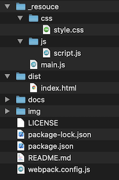

# maplibregljs-starter


Start MapLibre GL JS easily.  
- [MapLibre GL JS v4.0.0](https://maplibre.org)  
- [TypeScript v5.3.3](https://www.typescriptlang.org)  
- [Vite v5.1.1](https://vitejs.dev)  
- node v21.6.0
- npm v10.2.4

<br>

## Usage



<br>

Install package
```bash
npm install
```

<br>

build
```bash
npm run build
```

<br>

dev
```bash
npm run dev
```

---

<br>
<br>


<br>

## License
MIT

Copyright (c) 2023-2024 MapLibre User Group Japan

<br>

---

<br>

### Japanese

<br>

# MapLibreGLJS スターター


MapLibre GL JSを手軽に始める
- [MapLibre GL JS v4.0.0](https://maplibre.org)  
- [TypeScript v5.3.3](https://www.typescriptlang.org)  
- [Vite v5.1.1](https://vitejs.dev)  
- node v21.6.0
- npm v10.2.4

<br>

##  使用方法


<br>

パッケージインストール

```bash
npm install
```

<br>

ビルド

```bash
npm run build
```

<br>

開発

```bash
npm run dev
```

<br>
<br>


<br>

## ライセンス
MIT

Copyright (c) 2023-2024 MapLibre User Group Japan

<br>
